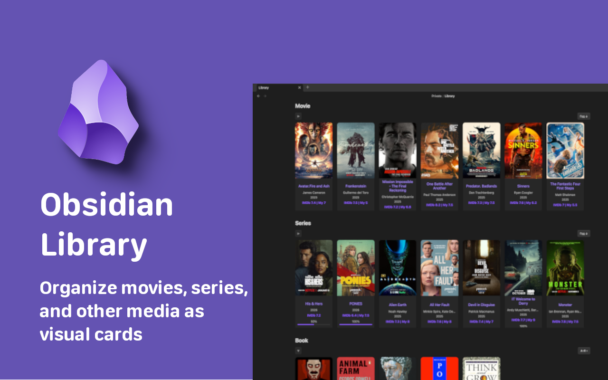

<p align="center">
  
</p>

<h1 align="center">Obsidian Library</h1>

<p align="center">
  
  
  
  
</p>

<p align="center">
  <b>Organize your movies, series, and books into a stunning visual gallery directly within Obsidian.</b>
  <br />
  Automatically fetch metadata, track your viewing progress, and manage your media collection with ease.
</p>

---

## ✨ Key Features

- 🖼️ **Visual Card Grid** — Transform simple markdown notes into a beautiful gallery of cover-art cards.
- 🤖 **OMDb Integration** — Automatically pull ratings, posters, genres, and directors using the OMDb API.
- 📺 **Smart Series Tracking** — Keep track of seasons and episodes for ongoing shows with auto-updates.
- 📊 **Progress Indicators** — Visual progress bars on cards and note headers to show exactly how much you've watched or read.
- 📑 **Rich Note Headers** — Every media note gets a beautiful, auto-generated header containing all key metadata.
- 🛠️ **Custom Categories** — Fully flexible! Create categories for Movies, TV Shows, Books, Games, or Anime.
- 🔀 **Sorting** — Sort your cards by name, year, rating, or date added — ascending or descending.
- 📁 **Collapsible Sections** — Collapse/expand each category in the library view.
- 🖥️ **Wide Mode** — Library note automatically switches to a full-width layout for a better overview.
- 🌍 **Multilingual** — Native support for English, Russian, German, Spanish, and French.

---

## 🚀 Quick Start

### 1. Installation

Find **Library** in the Obsidian Community Plugins browser, or install it manually via the [GitHub Releases](https://github.com/Kigrok/obsidian-library-plugin/releases).

### 2. Basic Setup

1. Go to **Settings** → **Library**.
2. Set your **Library file** path (e.g., `Library.md`).
3. Add your **Categories** (e.g., Name: `🎬 Movies`, Type: `Movie`).
4. _(Optional)_ Enter your [OMDb API Key](https://www.omdbapi.com/apikey.aspx) for automated metadata fetching.

### 3. Create a Media Note

Create a new note and add the IMDb URL to the frontmatter — the plugin will automatically fetch all metadata:

```yaml
---
Type: Movie
URL: https://www.imdb.com/title/tt1375666/
---
```

> **⚠️ Important:** To trigger automatic metadata fetching, add the `URL` field with a link to the movie or series page on [IMDb](https://www.imdb.com). The plugin extracts the IMDb ID from the URL and uses it to pull all data (title, year, genre, poster, rating, creator, etc.) via the OMDb API.
>
> You can also fill in `Type` and `Name` without a URL — the plugin will search OMDb by title. However, providing the IMDb URL guarantees the most accurate match.

---

## 📝 Frontmatter Schema

The plugin reads and writes to standard YAML frontmatter. You can edit these fields manually or let the plugin manage them automatically.

### Movie

```yaml
---
Type: Movie
Name: Inception
Year: 2010
Genre:
    - Action
    - Sci-Fi
Creator:
    - Christopher Nolan
Rating IMDB: 8.8
My Rating: 9
Cover: https://m.media-amazon.com/images/...
URL: https://www.imdb.com/title/tt1375666/
Progress: 1/1
Complete: true
Date: 01.03.2026
---
```

### Series

```yaml
---
Type: Series
Name: Stranger Things
Year: 2016
End Year: 2025
Season: 5
Genre:
    - Drama
    - Fantasy
    - Horror
Creator:
    - The Duffer Brothers
Rating IMDB: 8.7
My Rating: 9
Cover: https://m.media-amazon.com/images/...
URL: https://www.imdb.com/title/tt4574334/
Progress: 25/42
Complete: false
Date: 01.03.2026
---
```

> **📺 Series auto-update:** When new episodes air, the plugin automatically updates the total episode count in `Progress` (e.g., `25/42` → `25/50`) and the `Season` count, while keeping your watched count intact.

---

## 🛠 Commands

| Command                              | Description                                                                                                |
| ------------------------------------ | ---------------------------------------------------------------------------------------------------------- |
| `Fetch IMDb rating for current note` | Manually trigger a full metadata update for the active note. Also runs automatically when you open a note. |

---

## 🤝 Contributing & Support

- 🐛 **Found a bug?** Open an [Issue](https://github.com/Kigrok/obsidian-library-plugin/issues).
- 💡 **Have a feature idea?** Start a [Discussion](https://github.com/Kigrok/obsidian-library-plugin/discussions).
- ⭐ **Love the plugin?** Consider starring the repository to show your support!

---
