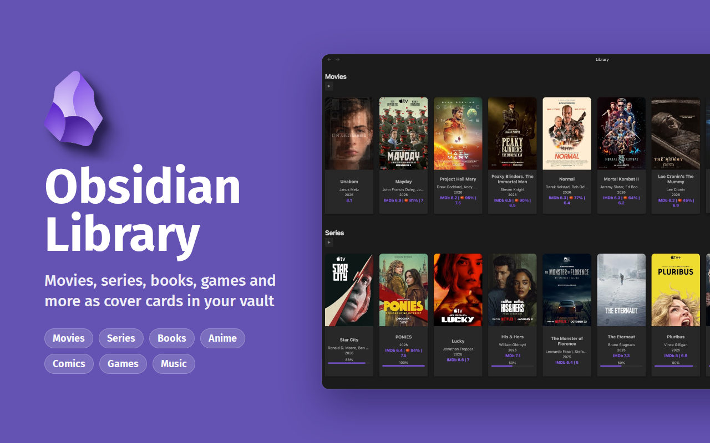

<p align="center">
  
</p>

<h1 align="center">Library</h1>

<p align="center">
  
  
  
  
</p>

<p align="center">
  Your watchlist, reading list, and game backlog as a gallery of covers, kept as plain Markdown notes in your vault. Search a title, pick a result, and Library writes the note: cover, year, genres, and creators, plus a trailer for movies, series, anime, and games.
  <br />
  <a href="https://community.obsidian.md/plugins/library">Community Plugins directory</a> · <a href="https://github.com/venvk/obsidian-library-plugin/wiki">Wiki</a>
</p>

## Features

- Ratings and stills for movies, series, anime, and games when the source has them; cast for movies and series.
- Movies, series, games, and comics can be found by their title in another language.
- Tick episodes or chapters and score them; `Progress` and `My Rating` follow. A movie is watched or not.
- Categories and their folders (Library/Movies, Library/Books) appear as you add titles.
- Titles you haven't started get an eye on the cover and gather in Up next.
- Similar titles under movie, series, anime, game, and book notes.
- Start new notes from a template of your own, and keep source fields you don't want out of them.
- Anime sync with AniList and MyAnimeList, Steam library import, and share cards.
- Genres, creators, and actors are links that collect their titles.
- Every field is in frontmatter, so Bases and Dataview can read it.
- Desktop and mobile, with the interface in every language Obsidian supports.

## Quick start

1. Install Library from Settings → Community plugins, or from [GitHub Releases](https://github.com/venvk/obsidian-library-plugin/releases).
2. Open the Library tab from the ribbon, press +, pick what you are adding (Movies, Series, Books, Comics, Games, Music, Anime, or your own), and search. The first title of each kind creates its category and folder.
3. For movies and series, a year after the title picks between films that share a name: `dune 1984`.

Settings → Library → Categories renames categories and moves their folders; the notes can move along.

The [wiki](https://github.com/venvk/obsidian-library-plugin/wiki) has the details: [API keys](https://github.com/venvk/obsidian-library-plugin/wiki/Sources-and-API-keys), [anime sync](https://github.com/venvk/obsidian-library-plugin/wiki/Anime-sync), [Steam import](https://github.com/venvk/obsidian-library-plugin/wiki/Steam-library-import), and [note properties](https://github.com/venvk/obsidian-library-plugin/wiki/Frontmatter-reference).

## Sources

| Category | Sources | First, with a key |
| --- | --- | --- |
| Movies, series | Cinemeta, Wikidata | [OMDb](https://www.omdbapi.com/apikey.aspx) |
| Books | Open Library | [Google Books](https://console.cloud.google.com/apis/library/books.googleapis.com) |
| Games | Steam, Wikidata | [RAWG](https://rawg.io/apidocs) |
| Music | Deezer | |
| Anime | AniList | [MyAnimeList](https://myanimelist.net/apiconfig) Client ID |
| Comics | Wikidata, AniList for manga | [Comic Vine](https://comicvine.gamespot.com/api/) |
| Anything else | Manual: you fill the fields | |

Keys go in Settings → Library → API keys. A [TMDB key](https://www.themoviedb.org/settings/api) adds season ratings and more stills, a [Twitch application](https://dev.twitch.tv/console/apps) adds game trailers from IGDB, and a [Steam Web API key](https://steamcommunity.com/dev/apikey) imports the games you own with their playtime. Settings → Library → Show recommendations hides the similar titles.

## Progress and statistics

Open a season in a series note to tick episodes and score them from 1 to 10. `Progress` counts the ticked episodes, and `My Rating` averages the season scores. Anime is one season. Books get chapters from Open Library, or from Add chapters in the note header.

A series, anime, or book is done when its progress is full; a finished series and a read book then hide their progress. A movie has no progress: `Complete` says whether you watched it.

Settings → Library can hide Up next or keep its titles out of their categories. The statistics panel shows the top lists you pick and your hours on movies, series, and anime.

## Anime sync

Anime notes sync with AniList and MyAnimeList through four commands. Push sends the open note's progress, status, and score; pull updates your notes from your list, never moves progress back, and leaves `My Rating` alone. Nothing syncs on its own. The [wiki](https://github.com/venvk/obsidian-library-plugin/wiki/Anime-sync) shows how to connect each site.

## Frontmatter

Each card is a note, and everything the plugin knows about it is in the frontmatter:

```yaml
---
Type: Series
Name: Stranger Things
Year: 2016
Genre: ["[[Drama]]", "[[Horror]]"]
Creator: ["[[The Duffer Brothers]]"]
Cast: ["[[Winona Ryder]]"]
Rating IMDB: 8.7
Runtime: 42
My Rating: 9
Cover: https://m.media-amazon.com/images/...
URL: https://www.imdb.com/title/tt4574334/
Progress: 8/42
Date: 01.03.2026
Source: omdb
Source ID: tt4574334
---
```

A refresh fills empty fields and updates the sources' ratings, never yours. The [wiki](https://github.com/venvk/obsidian-library-plugin/wiki/Frontmatter-reference) lists every property.

## Privacy and network use

Your library is plain notes that open offline; covers load from the web. The plugin goes online to search, refresh, sync, or share, when you open a library note (at most once in 5 minutes), and once after an update or a key change. It has no telemetry or self-update, and each key goes only to its own service.

| Hosts | Use | Data sent |
| --- | --- | --- |
| `www.omdbapi.com`, `m.media-amazon.com` | Movie search with a key, its posters | Title or IMDb id, key |
| `v3-cinemeta.strem.io`, `images.metahub.space`, `episodes.metahub.space` | Movies, series, stills | Title or IMDb id, genre |
| `api.themoviedb.org`, `image.tmdb.org` | Movie and series details, with a key | IMDb id, key |
| `www.wikidata.org`, `en.wikipedia.org`, `upload.wikimedia.org` | Search, Rotten Tomatoes, trailers, covers | Search text, ids |
| `openlibrary.org`, `covers.openlibrary.org` | Books, chapters, covers | Title, author, ISBN, genres |
| `www.googleapis.com`, `books.google.com` | Book search with a key, its covers | Title, key |
| `api.rawg.io`, `media.rawg.io` | Games, with a key | Title or id, genre, key |
| `store.steampowered.com`, `cdn.cloudflare.steamstatic.com`, `video.akamai.steamstatic.com`, `shared.akamai.steamstatic.com`, `api.steampowered.com` | Games, trailers, Steam import | Title or app id; key and SteamID on import |
| `id.twitch.tv`, `api.igdb.com` | Game trailers, with Twitch keys | Twitch ID and secret, game |
| `api.deezer.com`, `cdn-images.dzcdn.net` | Music search, covers | Album or artist |
| `graphql.anilist.co`, `anilist.co`, `s4.anilist.co`, streaming services' image hosts | Anime, manga, sync | Title or ids; your token, progress, status, score |
| `myanimelist.net`, `api.myanimelist.net`, `api-cdn.myanimelist.net` | Anime search with a Client ID, covers, sync | Search text, Client ID and secret; your token, progress, status, score |
| `comicvine.gamespot.com` | Comic search, with a key | Title, key |
| `www.youtube.com`, `www.youtube-nocookie.com`, `i.ytimg.com`, `player.vimeo.com`, `www.dailymotion.com` | Trailers | Video id |
| `twitter.com`, `t.me`, `wa.me`, `www.reddit.com`, `www.facebook.com`, `www.linkedin.com`, `vk.com`, `bsky.app`, `www.pinterest.com` | Share buttons | Caption with title, score, and link; the image stays local |

## Commands

- `Open Library`
- `Add content`
- `Search your library`
- `Refresh metadata for current note`, `Refresh metadata of all notes`
- `Rebuild graph links`
- `Find & remove duplicates`
- `Share current note`
- `Push current note to AniList`, `Pull progress from AniList`
- `Push current note to MyAnimeList`, `Pull progress from MyAnimeList`
- `Import Steam library`

## Support

Report bugs and suggest ideas in [Issues](https://github.com/venvk/obsidian-library-plugin/issues/new/choose); ask questions in [Discussions](https://github.com/venvk/obsidian-library-plugin/discussions). The plugin is under the [MIT License](LICENSE).

<a href="https://buymeacoffee.com/venvk"></a>

<details>
<summary>If the plugin is useful to you, you can support it</summary>

| | Network | Address |
| --- | --- | --- |
|  | **EVM** | `0xf9B4807E107f6f8Db79D86aCef6072A31d570201` |
|  | **Sui** | `0x1d6989810ee7e55d43f65398253b02462b921e9ce8ad626b542929f02c3d3e9a` |
|  | **Sol** | `2jmrmQrLVeUDFgHzSkHvHKBrmRJXes5X8h3GHXxrLaX6` |
|  | **BTC** | `bc1q4pdlj35uev8r0rgncpmn999n3jvj472pppds6r` |
|  | **TON** | `UQCphscY14j0AiRY1lGPciQjd9_XcRbUDyPLDxG4O1unEpgM` |
|  | **Tron** | `TYhmDLfx7aGHL1ikmNN3t72oGB3DjBjydR` |

</details>
