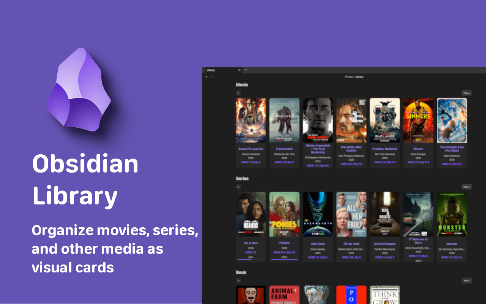

> UZ | [EN](README.md) | [RU](README.ru.md) | [UK](README.uk.md) | [DE](README.de.md) | [ES](README.es.md) | [FR](README.fr.md) | [ZH](README.zh.md) | [JA](README.ja.md) | [KO](README.ko.md) | [AR](README.ar.md)

<p align="center">
  
</p>

<h1 align="center">Library</h1>

<p align="center">
  
  
  
  
</p>

<p align="center">
  <b>Organize your movies, series, books, and more into a visual gallery — right inside Obsidian.</b>
  <br />
  Search and add titles in-app, auto-fetch metadata, track progress, and wire everything into your graph.
</p>

<p align="center">
  <a href="https://community.obsidian.md/plugins/library">View on the Obsidian Community Plugins directory</a>
</p>

---

## Key Features

- **Visual Card Grid** — A dedicated Library tab renders your collection as a gallery of cover-art cards.
- **Built-in Search** — Search and add titles right inside the app: OMDb for movies and series, Open Library or Google Books for books, RAWG for games, Deezer for music, Jikan for anime, Comic Vine for comics.
- **Smart Series Tracking** — Seasons and episode totals are fetched automatically and kept in sync.
- **Progress Indicators** — Visual progress bars on cards and note headers show how much you've watched or read.
- **Rich Note Headers** — Every content note gets an auto-generated header with all key metadata.
- **Custom Categories** — Create categories for Movies, Series, Anime, Comics, Books, Games, Music, or anything else via the manual source.
- **Graph Links** — A `Related` frontmatter property links every note to its category, genres, and creators, kept in sync automatically for a beautiful graph.
- **Sorting & Collapsing** — Sort cards by name, year, rating, or date; collapse any category.
- **Statistics** — Top genres, top creators (movies & series only), and top items per category with medal rankings.
- **Duplicate Detection** — Automatically prevents adding the same title twice by URL. A built-in command finds and removes existing duplicates.
- **Multilingual** — 31 languages: English, Ukrainian, Russian, Belarusian, Kazakh, Uzbek, German, Spanish, French, Italian, Dutch, Czech, Croatian, Polish, Romanian, Turkish, Azerbaijani, Persian, Hindi, Bengali, Urdu, Tagalog, Vietnamese, Thai, Javanese, Japanese, Korean, Chinese, Arabic, Sinhala, Hebrew.

---

## Quick Start

### 1. Installation

Install **Library** from the [Obsidian Community Plugins directory](https://community.obsidian.md/plugins/library) (Settings > Community plugins > Browse > search "Library"), or install it manually via the [GitHub Releases](https://github.com/Kigrok/obsidian-library-plugin/releases).

### 2. Basic Setup

1. Go to **Settings** > **Library**.
2. Add your **Categories** — select a predefined type (Movies, Series, Books, Comics, Games, Music, Anime, or Manual) from the dropdown and click **Add category**. Each category has a display name (translated to your language), a `Type` value (always English, e.g. `Movie`), a source, and an optional folder for storing notes.
3. _(Optional)_ Enter API keys for the services you use: [OMDb](https://www.omdbapi.com/apikey.aspx) for movies/series, [RAWG](https://rawg.io/apidocs) for games, [Comic Vine](https://comicvine.gamespot.com/api/) for comics. Anime (Jikan) and music (Deezer) require no key.

### 3. Add a Card by Title

No more filling in frontmatter by hand — add a movie, series, book, anime, or comic just by searching its name:

1. Open the **Library** tab from the ribbon icon (or run `Open Library`).
2. Click the **+** button in the top-right of the Library page (or run `Add content`).
3. Pick a category, type the **title** into the search box, and select a result.
4. A card is created instantly, with poster, year, genre, creators, and rating filled in automatically.

The **Search** button next to **+** searches titles already in your library.

For **Manual** categories you just type a title and fill in the cover, year, and other fields yourself.

---

## Statistics

The Library tab includes a collapsible **Statistics** section at the top:

- **Top Genres** — ranked by frequency across your entire library.
- **Top Creators** — ranked by number of movies and series they appear in.
- **Top per Category** — for each category (Movies, Series, Books, etc.), the top 3 items by rating with small cover thumbnails.

---

## Duplicate Detection

Library prevents duplicate entries by checking the `URL` field:

- **On add** — if a note with the same URL already exists, it opens the existing note instead of creating a duplicate.
- **Find & Remove Duplicates** — run this command from the palette to scan all notes, group by URL, and selectively remove duplicates via a modal.

---

## Sources

Each category is bound to a source that powers its search:

| Source           | Content types   | API key                                                      |
| ---------------- | --------------- | ----------------------------------------------------------- |
| **OMDb**         | Movies, Series  | Free key required — [omdbapi.com](https://www.omdbapi.com/apikey.aspx) |
| **Books**        | Books           | Open Library (no key) + Google Books (optional free key). Results are merged — Google Books first, Open Library below. |
| **RAWG**         | Games           | Free key required — [rawg.io/apidocs](https://rawg.io/apidocs) |
| **Deezer**       | Music (albums)  | None                                                        |
| **Jikan**        | Anime           | None — free unofficial MyAnimeList API, no key needed       |
| **Comic Vine**   | Comics          | Free key required — [comicvine.gamespot.com/api](https://comicvine.gamespot.com/api/) |
| **Manual**       | Anything else   | None — you type the title and fill fields yourself          |

---

## Privacy & Network Use

Library is **offline-first**. The plugin only contacts the network when you actively search for a title to add, and only with the search terms you type:

| Service | When | What is sent | Why |
| --- | --- | --- | --- |
| `www.omdbapi.com` | You search an OMDb-backed category | The title you type and your OMDb API key | Fetch movie/series metadata (year, genre, cast, rating, poster, episode counts) |
| `openlibrary.org` | You search an Open Library category | The title you type | Fetch book metadata (author, year, subjects, cover id) |
| `covers.openlibrary.org` | A book card has a cover | The Open Library cover id | Load the cover image |
| `www.googleapis.com` | You search a Google Books category | The title you type and your Google Books key | Fetch book metadata (author, year, categories, page count, cover, ISBN) |
| `api.rawg.io` | You search a RAWG game category | The title you type and your RAWG key | Fetch game metadata (year, genre, developer, cover) |
| `api.deezer.com` | You search a Deezer music category | The album or artist you type | Fetch album metadata (artist, year, genre, track count, cover) |
| `api.jikan.moe` | You search an anime category | The title you type | Fetch anime metadata (title, year, genre, episodes, MAL score, synopsis, poster) |
| `comicvine.gamespot.com` | You search a comics category | The title you type and your Comic Vine key | Fetch comic metadata (title, year, publisher, issue count, cover) |

No other data ever leaves your vault. The plugin has **no telemetry, no analytics, and no self-update mechanism**. API keys (OMDb, Google Books, RAWG, Comic Vine) are stored only in your local plugin settings and are sent only to their respective services. Cover images load directly from the URLs returned by each source.

---

## Frontmatter Schema

The plugin reads and writes to standard YAML frontmatter. Notes are created for you, but every field is editable. `Source` and `Source ID` let the plugin refresh metadata later.

### Movie

```yaml
---
Type: Movie
Name: Inception
Year: 2010
Genre:
    - Action
    - Sci-Fi
Creator:
    - Christopher Nolan
Rating IMDB: 8.8
My Rating: 9
Cover: https://m.media-amazon.com/images/...
URL: https://www.imdb.com/title/tt1375666/
Progress: 1/1
Complete: true
Date: 01.03.2026
Source: omdb
Source ID: tt1375666
---
```

### Series

```yaml
---
Type: Series
Name: Stranger Things
Year: 2016
End Year: 2025
Season: 5
Genre:
    - Drama
    - Fantasy
    - Horror
Creator:
    - The Duffer Brothers
Rating IMDB: 8.7
My Rating: 9
Cover: https://m.media-amazon.com/images/...
URL: https://www.imdb.com/title/tt4574334/
Progress: 25/42
Complete: false
Date: 01.03.2026
Source: omdb
Source ID: tt4574334
---
```

> **Series auto-update:** Run `Refresh metadata for current note` (or just open the note) and the plugin updates the total episode count in `Progress` (e.g., `25/42` to `25/50`) and the `Season` count, while keeping your watched count intact.

### Book

```yaml
---
Type: Book
Name: Dune
Year: 1965
Genre:
    - Science Fiction
Creator:
    - Frank Herbert
Cover: https://covers.openlibrary.org/b/id/...-L.jpg
ISBN: 9780441013593
My Rating: 9
Progress: 412/688
Complete: false
Date: 01.03.2026
Source: openlibrary
Source ID: /works/OL893415W
---
```

### Anime

```yaml
---
Type: Anime
Name: Steins;Gate
Year: 2011
Genre:
    - Sci-Fi
    - Thriller
Creator:
    - シュタインズ・ゲート
Rating MAL: 9.07
Total Episodes: 24
Status: Finished Airing
Cover: https://cdn.myanimelist.net/images/anime/...
URL: https://myanimelist.net/anime/9253/Steins_Gate
Progress: 0/24
Complete: false
Date: 01.03.2026
Source: jikan
Source ID: 9253
---
```

### Comic

```yaml
---
Type: Comic
Name: Watchmen
Year: 1986
Genre:
    - Comics
Creator:
    - DC Comics
Cover: https://comicvine.gamespot.com/a/uploads/...
URL: https://comicvine.gamespot.com/watchmen/4050-33819/
Progress: 0/12
Complete: false
Date: 01.03.2026
Source: comicvine
Source ID: 33819
---
```

---

## Graph Links

Each content note gets a `Related` frontmatter property, kept up to date automatically — the note body is never touched:

```yaml
Related:
    - "[[Movie]]"
    - "[[Action]]"
    - "[[Sci-Fi]]"
    - "[[Christopher Nolan]]"
```

These links connect your notes through shared categories, genres, and creators, so the Obsidian graph view forms clean clusters. A real hub note is created per category (e.g. `Movie`) so clusters show even with unresolved links hidden. The property is written when a note is created and refreshed whenever its metadata changes — run `Rebuild graph links` only if you want to force a full rebuild.

---

## Commands

| Command                              | Description                                                              |
| ------------------------------------ | ----------------------------------------------------------------------- |
| `Open Library`                       | Open the Library gallery tab.                                           |
| `Add content`                        | Search a source and create a content note (or type a title for Manual). |
| `Search your library`                | Fuzzy-search and open any note already in your library.                 |
| `Refresh metadata for current note`  | Re-fetch metadata for the active note; updates series episode totals.   |
| `Rebuild graph links`                | Wire every content note to its category, genres, and creators.          |
| `Find & remove duplicates`           | Scan all notes by URL, show duplicates, and remove selected ones.       |

---

## Contributing & Support

- **Found a bug?** Open an [Issue](https://github.com/Kigrok/obsidian-library-plugin/issues).
- **Have a feature idea?** Start a [Discussion](https://github.com/Kigrok/obsidian-library-plugin/discussions).
- **Love the plugin?** Consider starring the repository to show your support!

---
